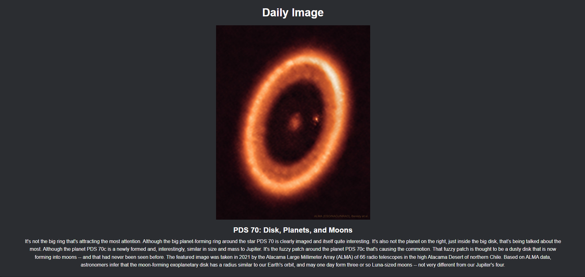
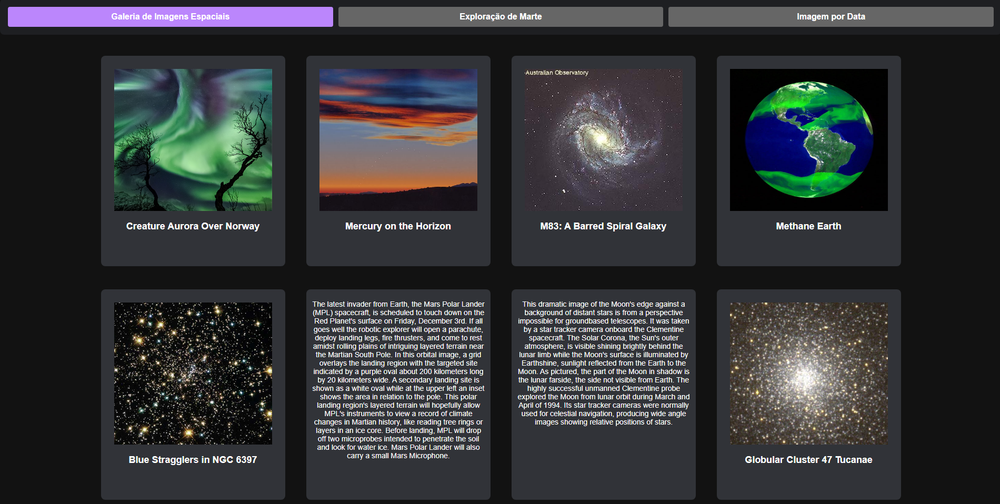
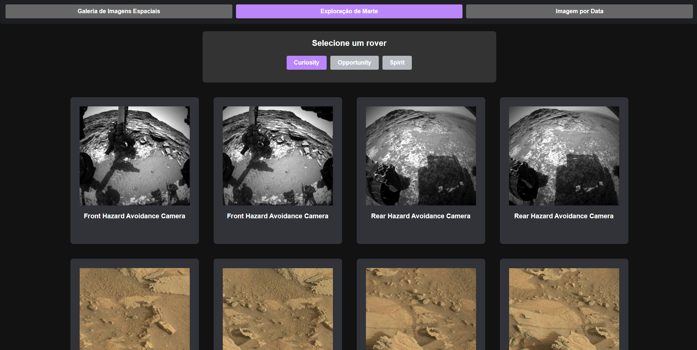
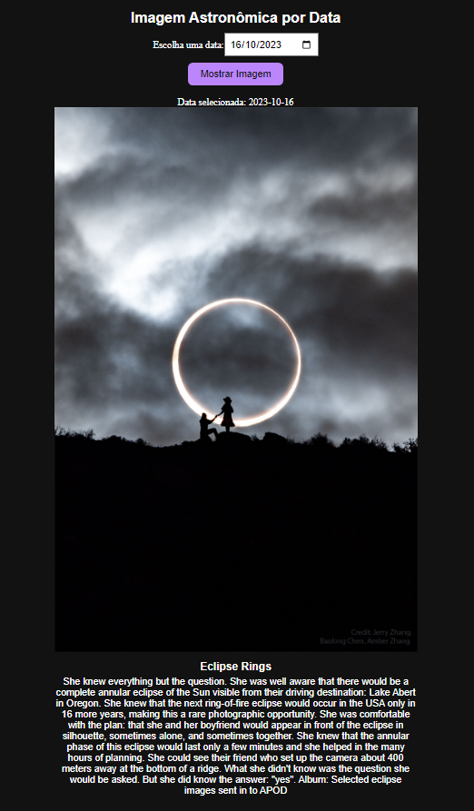

<h1 align="center">Projeto de Visualização de Imagens Espaciais</h1>

<p align="center">
  
</p>

---

## 💡 Sobre o Projeto

Este projeto é uma aplicação web que permite visualizar imagens relacionadas ao espaço sideral. Ele inclui duas funcionalidades principais:

- **Imagem Diária**: Exibe uma imagem com seus respetivos títulos e descrições que é atualizada todo dia. As imagens são obtidas da API da NASA.
<p align="center">
  
</p>
<br><br>

- **Galeria de Imagens Espaciais**: Exibe uma coleção de imagens do espaço sideral com seus respetivos títulos e descrições. As imagens são obtidas da API da NASA.
<p align="center">
  
</p>
<br><br>

- **Exploração de Marte**: Exibe imagens capturadas por rovers em Marte. As imagens são obtidas da API da NASA.
<p align="center">
  
</p>
<br><br>
  
- **Imagem por Data**: Exibe uma imagem e sua explicação com base na data escolhida pelo usuário. As imagens são obtidas da API da NASA.
<p align="center">
  
</p>

---

## 🚀 Como Executar o Projeto
A aplicação está disponível online através do serviço **Surge**. Você pode acessá-la [aqui](https://silent-birthday.surge.sh/)
<br><br>

Siga os passos abaixo para executar o projeto em seu ambiente local:

1. **Crie um projeto React em sua máquina**
   ```bash
   npx create-react-app nebulanexus
   ```
   
2. **Navegue até o diretório do projeto**
   ```bash
   cd nebulanexus
   ```
   
3. **Clone o repositório**
   ```bash
   git clone https://github.com/Victordplima/Nebula-Nexus.git
   ```

4. **Instalação de Dependências**
   ```bash
   npm install
   ```

5. **Inicialização da Aplicação**
   ```bash
   npm start
   ```


Isso irá iniciar a aplicação no modo de desenvolvimento. Abra [http://localhost:3000](http://localhost:3000) no seu navegador para visualizar o projeto.

---

## 🛠️ Tecnologias Utilizada

- React
- Axios (para fazer requisições HTTP)
- Styled Components (para estilização)
- API da NASA
